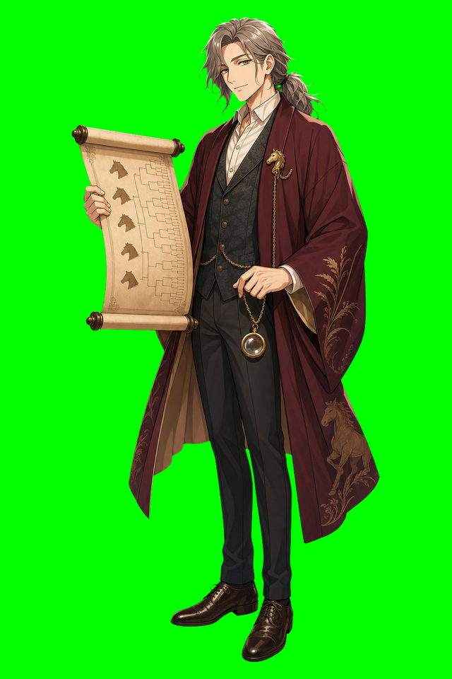
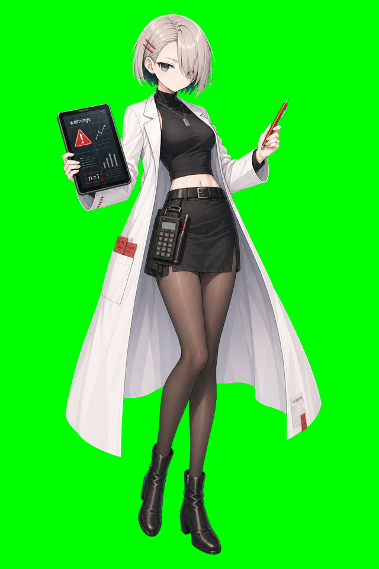
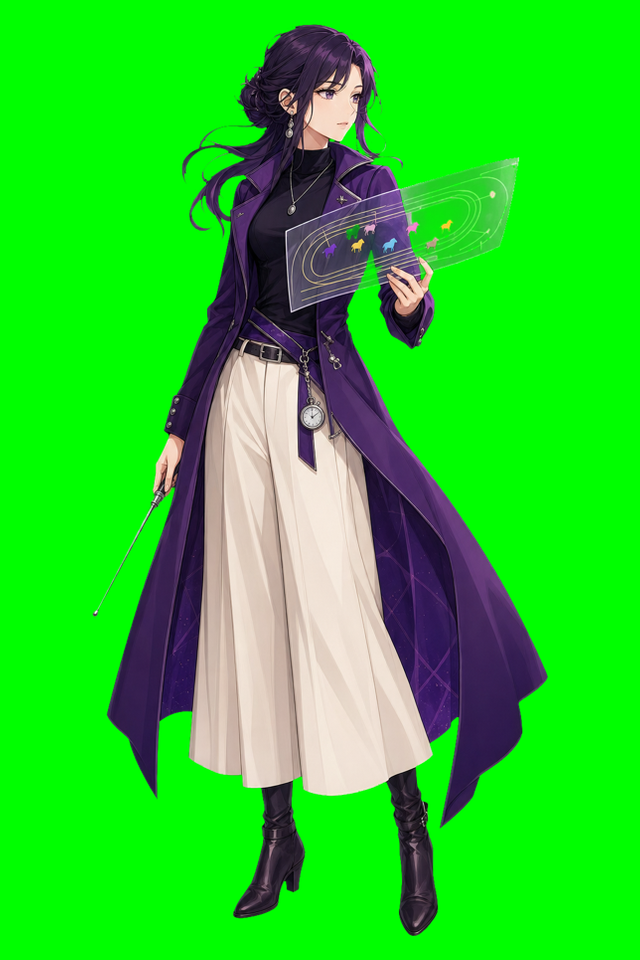
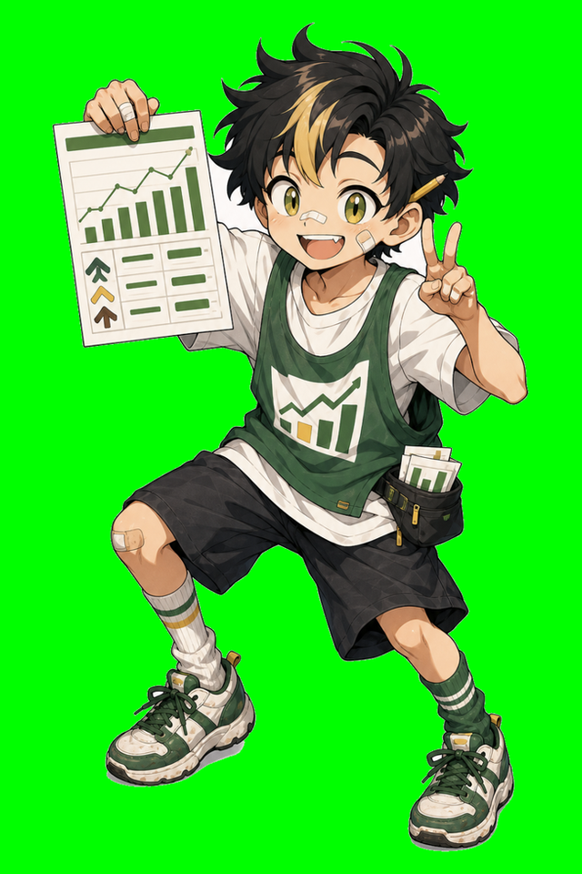
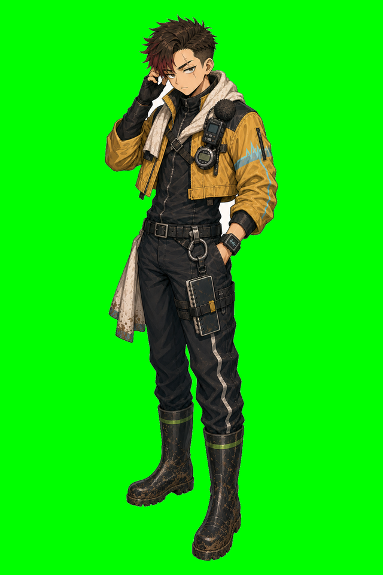
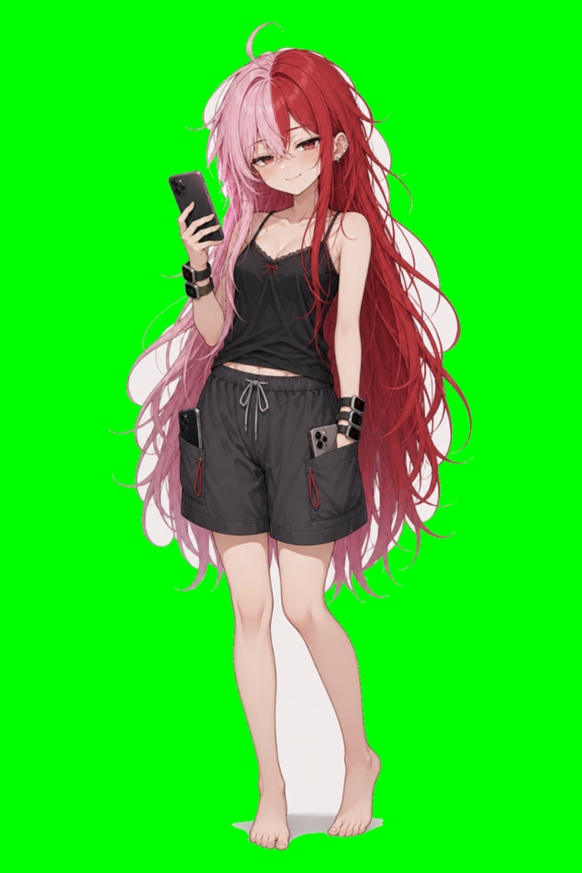
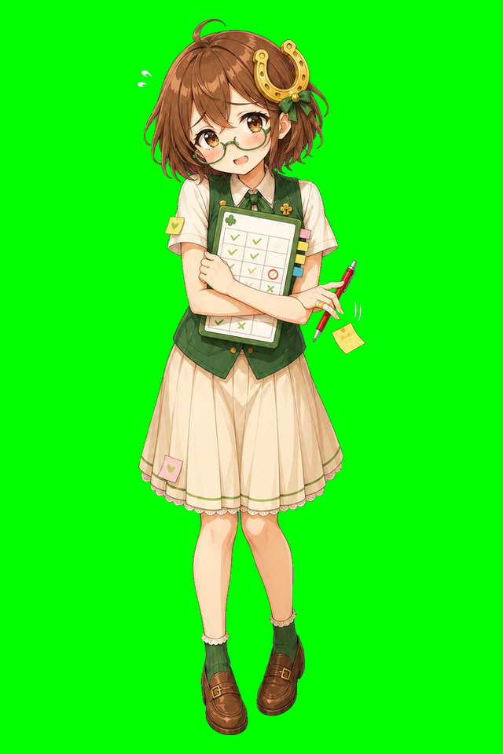
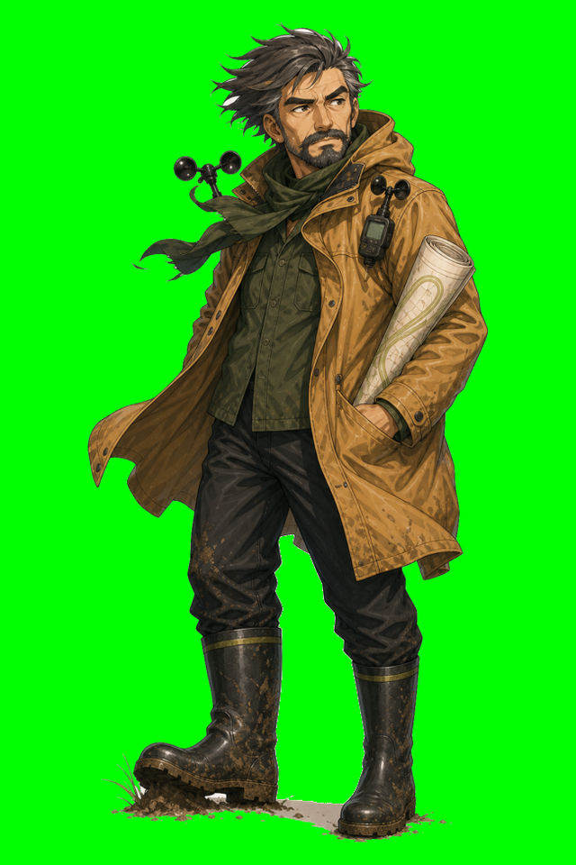

# 小物と衣装

画像ソース: `assets/characters/<id>/`（没/旧は `assets/characters-bench/`）

10人の立ち絵は、単なる見た目ではなく、それぞれの分析方法を身体化している。小物は予想スタイルの象徴であり、作戦室での席順や癖にもつながる。

serious版では、小物は「かわいい識別記号」ではなく、円卓から外れられない理由と結びつく。降格戦で机から片づけられるもの、観覧席から笑われるもの、本人が最後まで握っているものとして扱う。

## 共通トーン

リアル寄り立ち絵では、全員が「競馬場にいても、研究室にいても違和感がない」服装をしている。チビ版では小物が強調され、各キャラの役割が一目で分かる。

色のまとまりも流派に沿っている。

- 緑: 堅実、指数、チェック、期待値
- 青: 観察、知性、人間関係
- 紫: 展開、想像、見えない流れ
- 赤: 市場の熱、逆張り、血の物語
- 黄土色: 現場、馬場、追切、朝の空気

## 個別モチーフ

### 龍之介

巻物、羽織、懐中時計風の飾り。血統を「過去から続く文書」として読む人物。立ち姿は古風だが、目線は鋭い。手にした巻物は血統表であり、本人にとっては馬の家族史でもある。

小物の意味:

- 巻物: サイアーラインと母系の記録
- 羽織: 血統の古典性、語り部らしさ
- 懐中時計: 世代をまたいだ時間感覚

円卓での重み:

龍之介が降格すれば、この巻物は血統棚から外される。御影宗一郎から譲られたものなので、龍之介にとっては席以上に重い。

### 誠

白衣、タブレット、腰の計算機。感覚を排して数値で見る人物。白衣は研究者らしさであり、黒い服は無駄のない判断を表す。

小物の意味:

- タブレット: 統計表、回帰結果、検証ログ
- 計算機: 最後は手元で検算する癖
- 白衣: 感情から距離を置く姿勢

円卓での重み:

誠のタブレットには、佐伯怜と作った古いモデル名が残っている。降格が近づくほど、そのフォルダを消せなくなる。

### 美咲

紫のロングコート、透明なコース図、指し棒。展開を空間として見る人物。未来のレースを頭の中で映像化し、コース図の上で馬たちを動かす。

小物の意味:

- 透明ボード: まだ確定していない未来のレース
- 指し棒: 実況者であり演出家であること
- 紫の衣装: 直感、想像、流れの読み

円卓での重み:

展開を大きく外した夜、美咲は透明ボードから馬番マグネットを外せなくなる。外した未来も、自分が見たものだから。

### 健太

頬と膝の絆創膏、黒髪に走る金メッシュ、八重歯、縦長気味の瞳。緑の指数カードを握って、いたずらを思いついた顔で走り出す。明るく若いが、判断は驚くほど直線的。指数差が出た瞬間に結論が出る。

小物の意味:

- 絆創膏: 指数表を取りに走って転ぶ元気さ
- 金メッシュ: 素直な主人公では終わらない、少しやんちゃな違和感
- 縦長気味の瞳と八重歯: 猫っぽい目つきと浅い悪だくみ
- 緑の指数カード: 直近5走、最高値、平均値を一枚で見たがる癖
- 旧健太デザイン: `assets/characters-bench/kenta-legacy-mid.png`, `assets/characters-bench/kenta-legacy-real.png`

円卓での重み:

健太の指数表には、兄の速水陸なら絶対に引かない赤い補正線が入る。その線は、健太が兄から離れるための線でもある。

### 鉄平

黄色い現場ジャケット、ストップウォッチ、追切ノート、首のタオル。黒髪の2ブロック、じと目気味の観察眼、眉から額へ走る古い傷跡。その傷で片眉が途切れている。早朝の坂路から来たような姿。理屈より先に「今週の動き」を見る。

小物の意味:

- ストップウォッチ: ラスト1Fと全体時計
- 追切ノート: 併せ馬、手応え、調教本数
- タオルと長靴: 現場にいた証拠
- 2ブロックとじと目: 爽やかな体育会系ではなく、朝の失敗を覚えている現場職人
- 眉から額の傷: 時計で説明しきれなかった気配を、まだ見続けている印

円卓での重み:

追切ノートの端には梶原式の記号が残っている。鉄平は消していない。消せない。

### さくら

淡いピンクと赤で左右に分かれた長髪、装飾のない黒いスポーツ寄りのキャミソール、ゆるい半ズボン、素足。成人だが小柄で幼く見える。市場の熱を読む人物だが、見た目は外に出る気配のない引きこもりである。

手にはスマホ。左右のポケットにもスマホ。両腕にはスマートウォッチを2、3個ずつ重ねている。通知が鳴るたびに部屋の空気が速くなるが、本人は寝ぼけ眼のまま少しだけ笑う。

小物の意味:

- 手持ちスマホ: いま触っている市場。締切前の最後の動きを見る
- 左右ポケットのスマホ: 複数市場、複数レイヤーの通知。外に出なくても世界が入ってくる場所
- スマートウォッチ: オッズ変動、単複乖離、人気帯別のアラート。市場の鼓動を身体に直接伝える装置
- 黒いスポーツ寄りのキャミソールと半ズボン: 部屋着のまま世界を見ている引きこもり性
- 赤/ピンクの左右ツートン髪: 平時の淡いピンクと、市場の熱を感じた赤

円卓での重み:

さくらのスマホには、結城まひろからの無言スクショが届く。両腕のウォッチが同時に震える日は、市場の鼓動であり、挑戦状でもある。

デザイン退避:

- 旧さくらデザイン: `assets/characters-bench/sakura-old-mob.png`, `assets/characters-bench/sakura-old-mob-real.png`

### 葵

若白髪まじりの丸い癖毛、丸眼鏡、困り眉の笑顔。インディゴの柔らかい作業カーディガン、クリームのニット、くすんだ緑のベスト。馬そのものだけでなく、騎手、厩舎、主戦、乗り替わりを見る。

小物の意味:

- 若白髪: 人の事情を見すぎる気苦労
- ミサンガ: 人との縁を簡単に切らない
- 丸眼鏡と困り眉の笑顔: 疑う前に理由を聞く
- 関係線ノート: 騎手と厩舎の線を、温度ごと残す
- 双眼鏡: 人と馬の距離を見る
- 馬モチーフの小さなピアス: 競馬以前に馬が好き

円卓での重み:

双眼鏡のイニシャルは仁科涼のもの。葵が師匠の線から独立できるかどうかは、この小物にずっと付きまとう。

デザイン退避:

- 旧葵デザイン: `assets/characters-bench/aoi-old-mob.png`, `assets/characters-bench/aoi-old-mob-real.png`
- メッシュ入り眼鏡イケメン案: `assets/characters-bench/aoi-sharp-mesh-glasses.png`

### 陽菜

白いジャケット、黒いスポーティな服、手にした馬券、ばらまかれる紙片。身軽で挑発的。人気の流れから一歩横に跳ぶ。

小物の意味:

- 馬券の束: 穴の可能性、外れを恐れない姿勢
- 紙片: 市場の思い込みを散らす
- スニーカー: いつでも横道に走れる

円卓での重み:

陽菜の紙片は軽い。だが赤札の日、その紙片は急に重くなる。兄の日向蓮が破滅させたものと同じ紙だから。

外野クレームが赤いログになった夜、陽菜は紙片を裏返して使う。表には `買いたい理由`、裏には `消してはいけない理由`。裏面が埋まらない穴馬は、もう本命にしない。

### 優子

ふわふわした茶色の髪、少しずれた眼鏡、緑のノースリーブベスト、クリーム色のスカート、抱きしめるチェックボード。真面目しか取り柄がないと思っていて、少しドジでも直向きに頑張る。堅実でやさしいが、言葉選びが不器用なので誤解されやすい。

小物の意味:

- チェックボード: 複勝圏の確認。守りの盾ではなく、本人が落ち着くための安心材料
- 眼鏡: 見落としを嫌う慎重さ。少しずれていると、頑張りが追いついていない感じが出る
- 赤ペンと付箋: 人気と信頼を分けるための印。落としかけたり服についたりする
- 指の絆創膏: 紙で切っても確認をやめない直向きさ

円卓での重み:

優子のチェックボードは、会議を止める道具であると同時に、本人が「ちゃんと役に立てている」と信じるための道具でもある。守るだけでは席は守れない。

外野から「人気馬を置くだけ」と言われた後、チェックボードには `安心料` という小さな欄が増える。そこに丸がついた馬は、人気があるからではなく、人気に寄りかかっていないかをもう一度疑われる。

### 吾郎

黄土色のコート、風速計、巻いたメモ、長靴。芝と風を読む現場監督。天気予報だけでなく、当週の芝がどう傷んだかを見る。

小物の意味:

- 風速計: 風、湿度、天候の変化
- 巻いた馬場メモ: 当週の内外バイアス
- 長靴: 実際に歩いて確かめる現場感

円卓での重み:

吾郎の長靴に泥がついていない日は、本人が一番それを気にしている。土屋玄斎なら見逃さない。

## 小物から生まれる日常

- 誠の計算機を健太が借りようとするたび、誠は無言で緑の指数カードを渡す。降格戦前だけ、健太はそのカードを返しに来ない。
- さくらのスマホ通知とウォッチの振動は、優子が反省会中だけミュートにする。ただし無言スクショの日は、優子も触らない。
- 鉄平のストップウォッチは、吾郎の風速計と同じ棚に置かれている。朝組が不調の週、その棚だけ空気が重い。
- 陽菜がばらまいた紙片は、葵が無言で拾って裏に関係線を書き足す。陽菜はそれを捨てずに持って帰る。
- 龍之介の巻物は、美咲の透明ボードの下敷きにされかけたことが一度ある。以後、巻物には小さく「非透明」と書かれている。その冗談が言えるうちは、まだ円卓は壊れていない。

## 降格時の小物処理

円卓から外れた者の小物は、すぐ捨てられない。

1週間だけ、円卓の背後にある「保留棚」に置かれる。復帰戦の権利が残っている者の小物は、そこに残る。完全に外部へ移る者の小物は、本人が取りに来る。

最も残酷なのは、本人ではなく新しい席の者がその小物を片づける場合である。

この制度のせいで、誰も他人の小物を軽く触らない。
