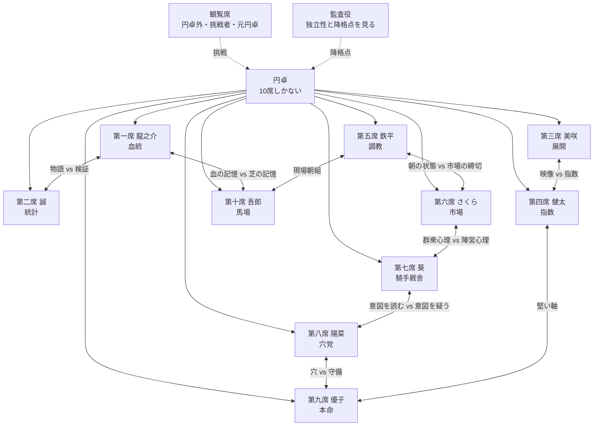

# 相関図

## 円卓全体図

## 円卓内の関係

### 龍之介と誠

前回設定の「血筋の語り部と数式の裁判官」は残す。ただし、今は単なる相性の悪いコンビではない。

血統派は、短期の成績評価では不利になりやすい。統計派は、その不利さを数字で容赦なく突きつける。龍之介は誠を嫌っていない。だが、自分の流派を消す理由が誠の表から出る可能性を知っている。

誠も龍之介を切り捨てたいわけではない。むしろ、少数意見が集団を救うことを知っている。だからこそ、龍之介には数字に耐える血統論を出してほしい。

### 美咲と健太

展開と指数。未来の映像と過去の速度。

2人はよく衝突するが、互いの存在が必要である。美咲の展開は、指数の裏づけがなければ夢になる。健太の指数は、展開の補正がなければ過去に閉じる。

降格点が危ない週、健太は美咲のボードを見る時間が長くなる。美咲はそれに気づいているが、言わない。

### 鉄平とさくら

鉄平は早朝の状態を読む。さくらは締切前の市場を読む。

2人の時間は噛み合わない。だが、調教で良かった馬が市場にまだ拾われていないとき、円卓は勝負できる。逆に、調教が悪いのに市場だけが過熱しているとき、2人は同時に険しい顔をする。

### 葵と陽菜

葵は意図を読む。陽菜は、意図が市場に見えすぎた瞬間を疑う。

葵は、陽菜の逆張りをただの暴走と見ない。陽菜も、葵の関係線をただの後づけとは思っていない。ただし、外野は陽菜を叩きやすい。穴党は外れ方が派手だからだ。

葵はそのたび、陽菜の根拠の中に本物の意図があるかを見ようとする。

### 優子と陽菜

前回の「よく目が合わない」は残す。ただし、意味は深くなる。

優子は円卓の守備で、陽菜は円卓の火である。優子がいなければ、円卓は無謀になる。陽菜がいなければ、円卓は市場と同質化する。

降格制度では、陽菜のほうが不利である。優子はそれを知っている。だから、陽菜の穴馬を簡単には切らない。守備職人だからこそ、必要な危険を守る。

ただし、優子は陽菜を甘やかさない。防御線のない穴は切る。陽菜も優子を安全地帯には置かない。疑いのない軸は「安心料」と呼ぶ。

二人が外野から同時に叩かれる週がある。優子が人気馬と沈み、陽菜が穴を拾えず、4番人気が勝つ週である。そのとき二人は互いをかばうのではなく、自分の流派の逃げ道を塞ぐ。

優子は言う。

「穴を見ない守備は、保身です」

陽菜は言う。

「軸を置かない穴は、逃避です」

この二重の反論が、二人をただの対照ではなく、互いの監査役にしている。

### 龍之介と吾郎

龍之介は血の記憶を見る。吾郎は芝の記憶を見る。

どちらも、今日の数字だけでは見えないものを扱う。外野からは「後づけ」と言われやすい。2人はその声に慣れている。

ただし、慣れていることと傷つかないことは違う。

### 誠と全員

誠は嫌われ役になりやすい。降格点、LogLoss、規約逸脱、欠損。彼が言葉にすると、誰かの言い訳が終わる。

だが、誠がいなければ円卓は物語に逃げる。

誠自身もそれを分かっている。だから、誰よりも自分の外れを許さない。

## 円卓外との関係

| 円卓メンバー | 外部人物 | 関係 | 火種 |
|---|---|---|---|
| 龍之介 | 御影宗一郎 | 師匠 | 古典血統を現代で更新できるか |
| 誠 | 佐伯怜 | 元共同研究者 | 説明可能性 vs ブラックボックス |
| 美咲 | 風間遥 | 憧れ/映像師 | 脳内実況が映像解析に勝てるか |
| 健太 | 速水陸 | 兄 | 指数原理主義を越えられるか |
| 鉄平 | 梶原みのり | 元相棒 | 時計と気配の決裂 |
| さくら | 結城まひろ | 元同僚 | 市場の熱 vs 板の冷たさ |
| 葵 | 仁科涼 | 元師匠 | 関係を見る者を越えられるか |
| 陽菜 | 日向蓮 | 兄 | 逆張りと破滅の境界 |
| 優子 | 森下千鶴 | 教え子 | 守備だけでは勝てるのか |
| 吾郎 | 土屋玄斎 | 旧友 | 現場知を円卓に残せるか |

## 対立軸

| 対立軸 | 守る側 | 壊す側 | 物語上の意味 |
|---|---|---|---|
| 人気馬 | 優子、健太、誠 | 陽菜、さくら、吾郎 | 市場に寄るか、市場を疑うか |
| 検証可能性 | 誠、健太 | 龍之介、美咲、鉄平、吾郎 | 数字にできないものをどう扱うか |
| 短期状態 | 鉄平、吾郎、さくら | 龍之介、誠 | 今週だけの変化と長期傾向 |
| 人間要素 | 葵、さくら | 誠、健太 | 意図を読むことの価値と危険 |
| 穴 | 陽菜、さくら | 優子、健太 | 集合知の多様性と降格リスク |

## 関係性の圧

円卓の人間関係は、仲の良さでは測れない。

本当に深い関係とは、相手の流派が降格点を受けたとき、それでも「その見方は必要だ」と言える関係である。

優子が陽菜を止めるのは、陽菜を消したいからではない。誠が龍之介を問い詰めるのは、血統を笑いたいからではない。健太が美咲に数字を求めるのは、展開を信じていないからではない。

円卓では、優しさも根拠を求められる。
